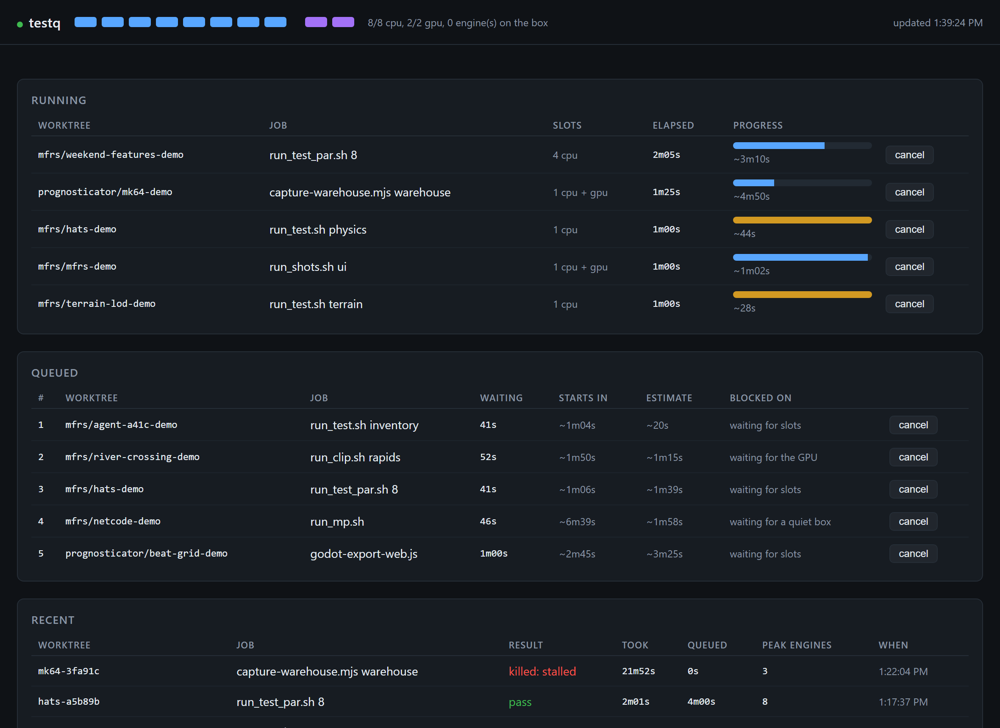
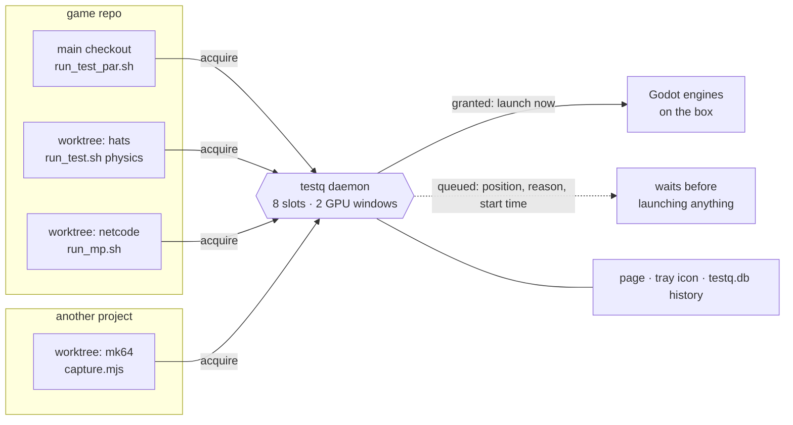

# testq

**One queue for every Godot run on a machine, belonging to no project.**

Run enough agents and worktrees on one box and your tests start failing for a
reason that is in nobody's diff: the other eight engines. testq is a small
daemon that holds the machine's slots, and the scripts that launch a Godot
engine — test suites, screenshot and clip harnesses, captures — ask it for one
first. Everything still runs; it just stops running on top of everything else.



<sub>The page at `localhost:43117`, here on a demo daemon with staged jobs.</sub>

- **Load failures stop looking like real ones.** Wall-clock assertions, frame
  budgets and a two-process clock-skew check all flip on a crowded box, and the
  log reads the same either way. Under the queue they get the machine they were
  written for.
- **It was faster, not slower.** The same suite at eight shards ran 1.6× faster
  than at four once nothing else was allowed on the box beside it.
- **Agents can see why they are waiting.** A queued run prints its position,
  what it is blocked on and roughly when it starts, so a session can decide to
  background the command instead of timing out and going round the queue.
- **A hung engine does not hold the GPU all afternoon.** A run that is late,
  idle and in somebody's way is killed, and its owner is told why on its next
  run.
- **Nothing to install.** One Python file, standard library only. The daemon
  starts itself the first time anything asks for a slot, and a client that
  cannot reach it runs anyway with a warning.



## What it needs

- **Windows only.** Processes are read through Win32 and the tray icon is
  PowerShell.
- **Godot 4**, spotted by image name (`TESTQ_GODOT_MATCH`).
- **Python 3, standard library only.** The Node client needs Node 18 or later.
- **Built for one machine and published as it is.** Capacity is a constant near
  the top of `testq.py` (`CAPACITY`: eight slots, two windows on the GPU), sized
  for a 16-core box with one card. Change it for yours.

The examples throughout name `mfrs`, a Godot game, and `prognosticator`, a DJ
visuals app. They are the two private projects this was built for, and their
run scripts (`run_test.sh`, `run_lib.sh`, `capture-warehouse.mjs` and the rest)
are not in this repository. Read them as worked examples of what a client looks
like, not as things to go and find.

## Why

There is one box, one GPU that takes two windows at a time, and eight slots'
worth of admission — a slot being
"a job's fair share of the machine", not a measured engine ceiling. (It was
four, on mfrs's finding that six and eight shards ran 1.5–1.7× slower than
four; retaken under the queue on a quiet box, that measurement did not
survive — eight shards run the same suite 1.6× faster than four, and the old
slowdown was neighbouring worktrees, which is this tool's whole thesis. The
box is 16 cores and 24 threads. mfrs's `run_test_par.sh` books a slot a shard up to
the capacity it reads from `/state`, so its default eight shards are the whole
box; a booking wider than the box is clamped to it.) Against the eight slots there are
several projects and a couple of dozen worktrees, each of which thinks it is
alone on the machine.

Two sessions starting `run_test_par.sh 4` in the same minute put eight engines
on a box neither of them measured, and everything that asserts against the wall clock starts
flipping: the generation budget, `Sfx.warm()`, and above all `run_mp.sh`, whose
whole verdict is a clock-skew measurement between two live processes. Those
failures read exactly like real ones. Several of them have reached pull
requests.

The scripts were already safe against *collision* — OS-assigned ports, output
directories keyed on the checkout, scratch keyed on the invocation. None of
that helps with *contention*. This is the missing half: a daemon holds the
slots and the run scripts ask before they launch.

**It sits outside every project because the contention does.** A warehouse
capture in the DJ app and a physics suite in the game are two engines on one
box, and neither repo can see the other's. A queue living inside one of them can
only manage half the load — and the half it cannot see is exactly where the
damage came from: prognosticator's capture script used to clear the box with
`taskkill /IM Godot....exe`, which killed every engine in every mfrs worktree
too, and at that end it read as a crashed test run with no error in it.

## Install

Clone it; there is nothing else to install, and the daemon autostarts the first
time a client asks for it.

    git clone https://github.com/BigFancyBen/testq.git

A client only has to find `testq.py` when it is the one starting the daemon.
The Node client looks at `TESTQ_PY`, then for a `_tools/testq/testq.py` beside
any directory above the one it was run from — so cloning into
`<projects>/_tools/testq` works with no configuration, and anywhere else works
with `TESTQ_PY` set.

    python testq.py start             # usually unnecessary
    python testq.py start --restart   # after editing testq.py
    python testq.py status
    python testq.py stats --days 7
    python testq.py stop [--force]
    python testq.py tray              # pin the icon up (it appears by itself)
    python testq.py reap              # delete scratch of deleted worktrees
    python -m unittest discover tests # the queue's own tests; starts nothing

State, the history database and the daemon's own snapshot live in
`%LOCALAPPDATA%\testq\`. `TESTQ_HOME` overrides. (An older
`%LOCALAPPDATA%\mfrs-testq\` is used instead when it exists, so a machine that
ran the tool under its first name keeps its history; see "History" at the end.)

The daemon listens on 127.0.0.1 only, and refuses any request that does not
come from this machine's own clients or its own page: a `Host` that is not
loopback, or an `Origin` that is not the daemon's. That second half is for the
browser — without it any website open on the machine could POST to `/cancel`.
There is no authentication beyond that, so every local user and process can
queue and cancel.

## Using it from a project

The client is the whole integration: ask before launching an engine, give the
slot back afterwards.

**Node** — vendor `clients/testq.mjs` into the project (the note at the top of
that file says why it is copied rather than imported across an absolute path):

```js
import { acquire } from './lib/testq.mjs';

const slot = await acquire({
  project: 'prognosticator',        // key into projects.json, optional
  script: 'capture-warehouse.mjs',  // what to call this on the page
  arg: 'warehouse',
  treePath: ROOT,                   // the checkout, for the worktree column
  gpu: 1,                           // it opens a window
  engines: 1,
  size: seconds,                    // how much work, so the estimate scales
  maxSeconds: seconds + 240,        // past this it has hung: stop
});
// ...launch the engine...
await slot.release(exitCode);
```

**Give every Node job a `maxSeconds`.** The bash harnesses wrap each engine in
`timeout`; nothing does that for a Node one, and an engine that finishes its
work and never exits then holds the GPU until somebody notices. With
`maxSeconds` the client ends the run itself, daemon or no daemon: it gives the
slot back, kills everything it started, and exits 124. The daemon enforces the
same number as a backstop (see "A run that hangs is killed" below).

Four optional fields say things only the job knows:

| Field (Node / wire) | Meaning |
|---|---|
| `size` / `size` | How much work this is, in whatever the job counts in — seconds to record, scenarios to shoot. The estimate is fitted to it. |
| `maxSeconds` / `max_s` | The longest this may run once it starts. |
| `idleOk` / `idle_ok` | A window that is meant to sit there. It will not be taken for a hang; `maxSeconds` still applies. |
| `slotsMin` / `slots_min` | The narrowest a job can run on, for one whose engine count follows the width it is granted. See "Flexible width". |

**Bash** — vendor `clients/testq.sh` the same way and source it:

```bash
. "$(dirname "${BASH_SOURCE[0]}")/testq.sh"
trap 'testq_release $?' EXIT
testq_acquire --arg "$WHICH" --cpu 1 --engines 1      # --gpu 1 if it opens a window
timeout 1500 "$GODOT" --headless --path "$PROJ" -- --test="$WHICH"
```

The flags are the same fields (`--cpu`, `--min-cpu`, `--gpu`, `--engines`,
`--exclusive`, `--mutex`, `--size`, `--max`, `--idle-ok`, `--project`); the
file's header lists them. The grant comes back in `$TESTQ_SLOTS` and
`$TESTQ_BOX_ENGINES`. Put the `timeout` round each engine and never round the
script, so that time spent queued is charged to nothing.

Anything else speaks the protocol directly: `POST /acquire`, long-poll
`POST /wait`, `POST /release`, all JSON, and the two clients are the reference
for what to send. Read the reply's `granted` **field**. A client that looks
for the word `true` anywhere after the word `granted` — which is what the
first bash client did, in thirty checkouts — takes a queued reply for a grant
the day that reply grows a second yes-or-no, and runs on top of whatever it
was queued behind. It did, three hundred times a day, and those runs were
most of the "engines outside the queue" the daemon was docking slots for. So
the daemon now keeps `true` out of every reply that is not a grant (its
yes-or-no fields are `1` and `0` there), and there is a test that holds it to
that.

The one rule in either language: acquire BEFORE any engine starts, including an
import pass, and give the slot back when the last engine exits. A run that has
to wait says so:

    [testq] the box is busy -- queued at position 2 (waiting for the GPU).
    [testq] nothing has launched yet; watch http://localhost:43117/
    [testq] starts in ~12m.
    [testq] if your command will time out before then, run it in the background; ...
    [testq] got the box after 704s -- starting

**The start time is rough, and it is there so you can decide.** It is one line
of arithmetic over the estimates already on the tickets ahead. Anything ahead
with no estimate turns it into "at least", and a job waiting on a mutex or on
engines the queue did not start gets no figure at all, because nobody has one.

**A ticket outlives its client, briefly.** A command with a ten-minute timeout
in a twenty-minute queue used to lose its place and start again at the back —
or give up and run outside the queue, which is worse for everybody. Now the
same job (worktree, script, arg) asking again within fifteen minutes gets its
waiting time back, which is what orders the queue and what ages a ticket to the
front. Two live copies of one job are still two jobs.

**So does a restart of the daemon.** `start --restart` keeps the running jobs
and forgets the queue, and every queued client finds that out on its next poll
and asks again — both clients do; the Node one used to run unqueued instead,
which put the whole queue on the box in the same second. The places are saved
with the leases and handed back the same way a dead client's is, so the queue
comes back in the order it was in.

### What the grant tells you back

A granted slot carries the number of engines this box is committed to carrying
while you run, yours included: `slot.boxEngines` in Node, `$TESTQ_BOX_ENGINES`
in bash, which `run_lib.sh` exports into the environment so the engine itself
can read it with `OS.get_environment()`. It is `0` when nobody can say —
unqueued, `TESTQ=off`, or a daemon too old to send the field.

It exists for wall-clock assertions, and it answers a different question from
"did the queue overload the box". A `run_test_par.sh 4` is granted the whole
machine and is *still* four engines deep in its own shards — mfrs's sound-bank
load budget failed at 577 ms exactly that way, with the queue having granted
correctly and nothing else on the box. The queue was right and the measurement
was worthless. So a test that times anything should assert only at `1`, and
should treat `0` as assert-anyway: infrastructure that silently drops
assertions is worse than the flake it would be dodging.

The number is fixed at the grant, which makes it a floor rather than a promise
— a one-slot job can still be joined later by whatever the three free slots
allow. The cases that cannot be joined, a job booking every slot or an
exclusive one, are exact. A run that knows its own engine count should raise
the floor itself rather than trust the grant for it, the way `run_test_par.sh`
does, because that number holds even with no daemon running at all.

A slot that is never released is not leaked. The daemon tracks each client by
(pid, creation time) and reclaims a dead one's slots within about five seconds,
so a script killed outright — or one whose failure path calls `exit` — costs the
queue nothing. Release explicitly anyway when you can: it is immediate, and it
records the exit code.

## Adding a project

The queue only knows about the engines that ask it. One harness that launches
Godot without asking is load every other project's tests are measured against
and cannot see, so the whole of the integration is making sure nothing does:

1. **Vendor a client** — `clients/testq.mjs` or `clients/testq.sh` — into the
   project. Copy it; do not import it across an absolute path.
2. **Every script that starts an engine acquires first**, before an import
   pass too, and releases when its last engine exits. One invocation is one
   job, however many engines it runs: say how many in `engines`.
3. **Book what it uses.** One slot a headless engine. `gpu: 1` if it opens a
   window. `exclusive` only for a measurement between live processes. A
   mutex for anything two runs must not do at once — a fixed port, a shared
   output directory.
4. **Give it a deadline**: `maxSeconds` in Node, a `timeout` round each engine
   in bash.
5. **No bare engine commands in the docs.** If a README or a tool's header
   says `godot --headless --script …`, that is what gets pasted, and it runs
   outside the queue for as long as it likes. Give one-off runs a wrapper that
   acquires, and document the wrapper.
6. **Do not teach `TESTQ=off`.** It is for debugging the queue itself. A
   headless suite does not need it to "stay off the GPU queue": a job that
   books no `gpu` is never in the GPU line.
7. Optionally register the project in `projects.json` (below), for estimates
   on a new worktree's first run and for `reap`.

Check it with `python testq.py status` while the project's suite runs: the job
should be a `RUN` line, and there should be no `OUT` line for its worktree.
`OUT` is an engine the queue did not start, by worktree — which is the list of
what is still to be brought in.

### What to tell the agents

Most runs on this box are started by an agent reading the project's
`CLAUDE.md`, so that file is where the rules have to be. Something like:

```markdown
## Running Godot

Every engine run on this machine goes through testq (`../_tools/testq`, page
at http://localhost:43117/). The run scripts ask it for a slot themselves.

- Start engines only through the project's run scripts. Never launch `godot`
  directly and never set `TESTQ=off`: an engine outside the queue slows every
  other worktree's tests and makes their timing failures look real.
- A run may print `[testq] queued at position N … starts in ~12m`. That is
  normal. Nothing has launched yet; do not cancel it and try another way.
- If the wait is longer than your command's timeout, run it in the
  background. A job killed while queued keeps its place for 15 minutes if the
  same command is run again.
- Do not kill Godot by image name (`taskkill /IM`). Other worktrees' runs are
  the same image.
- `python ../_tools/testq/testq.py status` shows what is running and queued.
```

## The page

**<http://localhost:43117/>** is the point of the thing: what is running, in
which project and worktree, for how long against its estimate; what is queued,
what it is waiting for and roughly when it starts; the engines running outside
the queue, **by worktree**; and the last fifty jobs with their exit codes — a
job the queue killed itself shows there in red, as `killed: stalled` or
`killed: overran`. Each row has a cancel button that really does
stop the work (see below). `python testq.py status` is the same thing in the
terminal.

## The history database

Every finished job is written to `testq.db` in the runtime directory, a SQLite
file with one `runs` table: which worktree, which script and argument, how long
it ran, how long it waited, how it exited, and the most engines the box was
carrying while it ran. It survives daemon restarts, worktree deletions and
reboots, so it accumulates across sessions.

    python testq.py stats --days 7 [--tree NAME]

gives engine hours, time lost to queueing and **what the queueing was for**,
per-job medians and worst cases, per-worktree totals, and — the useful one — a list of jobs that *sometimes*
pass and sometimes do not, which is the expensive kind of problem here and
easy to miss one run at a time.

Each row's `waited_on` is its queued seconds by reason, as JSON: `gpu` behind
another window, `slots` with every slot taken, `outside` for engines the queue
did not start, `ahead` for a free slot being held for a job in front, `quiet`
for an exclusive job waiting on the box to empty, `mutex`, and `away` for the
gap in a ticket whose client died and came back. It is there because a week of
history once said jobs had queued for 120 hours and could not say that most of
it was not behind another job at all. `daemon.log` gets a line naming the
worktrees whenever outside engines start holding a job up.

It is a plain SQLite file, so anything can read it:

```sql
-- is the suite getting slower on this branch?
SELECT date(finished,'unixepoch','localtime') d, COUNT(*) n, AVG(dur_s)
FROM runs WHERE script='run_test_par.sh' AND verdict='released'
GROUP BY d ORDER BY d;
```

The medians here are also what the queue schedules with: shortest-job-first
needs an estimate, and for anything with no `weights-*.json` entry — `run_mp`,
clips, screenshots, captures, or any worktree that has not yet run the full
suite — the estimate is the median of that job's own recent history, preferring
this worktree's runs and falling back to every worktree's.

That key — script and arg — is wrong for any job whose arg is not what decides
how long it takes. `capture-warehouse.mjs warehouse` is 48 s recording thirty
seconds and ten minutes recording five hundred. So a job with a **size** is
estimated from a straight line through that script's recent runs of the same
kind: a fixed cost plus so much a unit. The size is whatever the client sends
in `size`, or the leading number of an arg written like `148 scenarios`. Two
or more runs at exactly this size win over the line. And a job nothing else can
estimate gets the median of its script with any argument, which is rough and
still better than sorting behind everything: more than a quarter of all jobs
used to arrive with no estimate at all.

An older JSONL history file is imported once on first start and renamed to
`history.jsonl.imported`; nothing measured is thrown away.

## projects.json

Optional, in the runtime directory. Everything in it is a convenience: a project
that registers nothing still queues correctly, and still gets estimates once it
has run the same job twice.

```json
{
  "mfrs": {
    "root": "C:/Users/dev/Documents/projects/mfrs",
    "userdata": "%APPDATA%/Godot/app_userdata/Middle Fork River Slop",
    "scratch": "%TEMP%/mfrs",
    "scratch_subdirs": ["clips", "shots"],
    "weights": "test"
  },
  "prognosticator": { "root": "C:/Users/dev/Documents/projects/prognosticator" }
}
```

`userdata` + `weights` point at a directory of `weights-<TREE_ID>.json` files —
the tag → milliseconds map a suite publishes — which is what lets a brand new
worktree get a real estimate before it has any history of its own. `root`,
`scratch` and `scratch_subdirs` are what `reap` walks, and it only ever looks at
directories a project has named: a reaper that guesses where scratch lives is a
reaper that deletes somebody's work.

## The tray icon


**There is nothing to start.** The icon appears in the notification area
whenever the box is busy — any project, any worktree, whether the run was
started by you or by an agent — and takes itself away again a minute and a half
after the queue goes quiet. Any project's first `acquire` starts the daemon, and
the daemon raises the icon.

Hover for a one-line summary, left-click to open the page, right-click for the
running and queued jobs in full. The icon itself is the status: grey idle, blue
running, amber something waiting, purple engines on the box that the queue did
not start, red if the last job to finish did not pass — and a balloon when one
fails. The linger after the queue empties is what leaves that red dot and its
balloon on screen long enough to be read.

Windows 11 files new icons under the overflow chevron by default. Drag it onto
the taskbar to see it without opening the chevron — Windows remembers that
per-icon, so it holds for the ones raised on later runs too.

Unmanaged engines deliberately do not keep the icon up. An editor left open all
afternoon is an engine the queue did not start, and pinning a permanent icon on
that would make it furniture again — it still turns the icon purple while
something else is running.

    python testq.py tray          # pin it up permanently
    python testq.py tray --stop   # and take it down again

is there for when you want it up regardless: an icon asked for by hand stays
until it is dismissed, which is also true of "Hide this icon" on its menu —
dismiss it mid-run and it stays gone until the queue has gone quiet and come
back. There is no need for a `shell:startup` shortcut.

It is a PowerShell script (`tray.ps1`) using the tray API Windows already has,
not an Electron app. Everything the tray needs to do — sit in the overflow
area, stay out of the way, open on click, summarise on hover — is native
behaviour, and Electron would have added a couple of hundred megabytes of Node
and a second long-running process to a tool whose selling point is that it
installs nothing. It opens the same page either way.

### Environment

| Variable | Default | Meaning |
|---|---|---|
| `TESTQ` | `on` | `off` bypasses the queue entirely; `require` fails rather than run unqueued |
| `TESTQ_PORT` | `43117` | outside 27015–27022, which mfrs's `run_shots.sh ui` photographs |
| `TESTQ_AUTOSTART` | `1` | `0` to never spawn a daemon |
| `TESTQ_HOME` | — | runtime directory override |
| `TESTQ_PY` | — | path to `testq.py`, if a Node client's autostart cannot find it |
| `TESTQ_GODOT_MATCH` | `godot_v4` | image-name fragment used to spot engines |

Use `TESTQ=require` when a number has to be trustworthy — a performance
measurement you intend to quote. Use `TESTQ=off` when the queue itself is what
you are debugging.

## What each job books

The unit is the **script invocation**, never the engine process: `run_mp` needs
two engines alive at once and `run_test_par` wants N, so a per-process
semaphore of size one would deadlock both on the first call.

| Job | CPU | GPU | Engines | Notes |
|---|---|---|---|---|
| mfrs `run_test.sh` | 1 | – | 1 | |
| mfrs `run_test_par.sh N` | 2–min(N,8), flexible | – | = granted width | see "Flexible width" below |
| mfrs `run_mp.sh` | **all** | **all** | 2 | exclusive: its verdict is only meaningful on a quiet box |
| mfrs `run_shots.sh` | 1 | 1 | 1 | windowed; `ui` also takes the `ports:27015` mutex |
| mfrs `run_clip.sh` | 1 | 1 | 1 | takes `clip:<tree>:<scenario>`, closing the same-scenario frame-dir race |
| mfrs `run_perf.sh` | 1 | **all** | 1 | frame times it means to quote: no second window on the card |
| mfrs `run_attach.sh` | – | – | – | no engine, never queued |
| prognosticator `capture-warehouse.mjs` | 1 | 1 | 1 | windowed; releases when the engine exits, not when ffmpeg does |
| prognosticator `godot-export-web.js` | 1 | – | 1 | two headless passes, one after the other |

Queue order is **shortest first**, estimated from the `weights-<tree>.json` a
suite writes, so a twenty-second tagged slice does not sit behind two
eleven-minute suites. Nothing starves: a job that has waited longer than
`max(600 s, 2× its own estimate)` ages to the front (600 s flat for a job with
no estimate yet), and while a large job is at the head its unmet slots are
reserved so a stream of small ones cannot keep it out. A job blocked only on
the GPU reserves no slot — whoever holds the GPU hands a slot back with it —
and neither does anything further back in the GPU line, so CPU-only work goes
past all of it.

### Flexible width

A multi-slot job used to be lumpy: four slots have to be free *at once*, so a
parallel suite behind two long one-slot jobs sat waiting while two slots
idled. A job may now send `slots_min` alongside `slots` — "this is what I
want, this is what I can run on" — and the daemon will grant anything between
when starting narrow answers sooner than waiting for the full width. The
comparison is closed-form, because a flexible job is promising its total work
is fixed and divides across whatever width it gets: work `W` at granted width
`G` finishes at `W/G`; waiting `T` for the full `N` finishes at `T + W/N`.
Two slots freeing in thirty seconds still beat starting narrow, and the
arithmetic is why no shrink fires in that case.

The contract: a flexible job's **engine count follows the granted width**.
The client reads the width back (`$TESTQ_SLOTS` in bash, `slot.slots` in
Node) and launches exactly that many engines — `run_test_par.sh` picks its
shard count off the grant. A job whose engine count is fixed must never send
`slots_min`.

## Design notes worth knowing

**It never launches or pools a Godot process.** A warm engine would show up in
`run_mp`'s stray count and condemn every multiplayer run to INCONCLUSIVE
forever.

**The box is read straight from the kernel.** Counting engines used to be
`tasklist`, and reading their command lines PowerShell and WMI: a second
apiece, and on a loaded box WMI answers "Call cancelled" for minutes at a time.
For those minutes the daemon counted no engines on a box carrying eight —
the wrong direction to be wrong in, since it is what tells `run_mp` the box is
quiet. It is now a Toolhelp snapshot and two reads of each engine's own memory
(its command line and its working directory, which no Windows API reports), in
about 25 ms. A look that fails keeps the last count instead of reading as zero.
A parent pid is also checked against creation times, so a recycled number
cannot put a stranger under a job's shell.

**Engines it did not grant still count.** Worktrees without the client, and the
editor, are real load. The daemon counts what is actually on the box, subtracts
what it granted, and docks capacity by the difference (debounced over two
samples) — past the first four, and never below two slots. The eight slots
are a policy on a sixteen-core box, so the first few outside engines are paid
for out of the cores the policy leaves spare; docking one for one was the
queue's largest cost, three fifths of all queueing being jobs that waited with
slots free on paper, and twice it left the box empty for most of an hour
granting nothing. The floor is so that a crowd of them slows the queue and
cannot stop it, since a job that times out in a stopped queue gets run outside
it. `STRAY_FREE` and `STRAY_FLOOR`, beside `CAPACITY`. A run is still told
about every one of them in `boxEngines`, and an exclusive job still wants
none. That one rule also stops a restarted daemon from overgranting on top
of the previous one's orphans, and it is why the page can show "2 unmanaged
engines".

**An exclusive job gives them five minutes, and the box is not emptied for
it meanwhile.** `run_mp` wants no other engine at all, and an engine the queue
did not start is not the queue's to wait out — so it holds out for a quiet box
for `EXCLUSIVE_STRAY_PATIENCE` and then runs anyway, leaving the verdict to
`run_mp`'s own INCONCLUSIVE. That was the intent from the start and it did not
work: the fit was tested against capacity already docked by the stray, an
exclusive job needs all of it, so with one working engine outside the queue it
never fitted and the patience was never reached. It sat at the head reserving
every slot for as long as the stray lived; sixteen `run_mp` in nineteen gave
up in the queue. Now the test is "no running job and nothing held for a ticket
ahead", and while the five minutes run the job reserves nothing — it cannot
start before they are up, so other work goes past it, and the box drains for
it from the moment the strays leave or its patience does.

**Unless they are doing nothing.** An outside engine that has burned under a
tenth of a core for two minutes is listed as idle and docks no slot; it counts
again on the first reading that shows it working. Twenty-three headless probes
that finished their scripts and never exited once docked every slot on the box
and held their own session's queued jobs for sixteen minutes. The daemon does
not kill them — they are not its to kill — it only stops waiting for them.

**Two windows share the card, and a measurement books both.** GPU capacity was
one, and it was the worst line on the box: over a week GPU jobs ran for 17
hours and queued for 44, 34 of those behind another window. The card itself
was a quarter busy with three windowed engines up; what a window costs is
about 1.6 GB of its 12, which is why the number is two and not three. A shot
or a fixed-fps clip does not care who else is drawing. A job that does —
`run_perf.sh`, anything quoting a frame time — sends `gpu` equal to the
capacity in `/state`, and an ask for more than there is is clamped to all of
it. Prognosticator's live captures (`capture-warehouse.mjs`, `runLiveEngine`)
record against a wall-clock beat feed and book one: a second window can cost
them recorder frame rate, which they report and assemble at, not correctness.

**Leader election is the port bind**, with `SO_EXCLUSIVEADDRUSE` set before
bind. There is no lock file to go stale, and a second daemon exits quietly.

**The daemon never runs from a project.** `start` copies the file to
`<runtime dir>/testq-<sha>.py` and serves from there, recording where it came
from in `origin.txt`; `serve` refuses to run from anywhere else. Editing this
file, or deleting the checkout it lives in, cannot tear a running daemon out
from under itself. `origin.txt` is also how a client that gets a protocol
mismatch can be told which copy to restart, now that there can be more than one.

**Liveness is (winpid, creation time).** Bash's `$$` is an MSYS pid that no
Windows API has heard of, so the bash client sends `/proc/$$/winpid`; Node's
`process.pid` is already the Windows one. The creation time is there because
Windows reuses pids briskly and a killed run's slots must not be held open by
whatever inherited its number. A client killed outright is reclaimed within
about five seconds without its EXIT trap ever running.

**Cancelling takes several passes.** `taskkill /F /T` on the run's shell is not
enough — Git-Bash nests a second `timeout.exe` between shell and engine, the
console build of Godot launches the real one as its own child, and the chain
re-parents as its links die. A single sweep reliably left two engines running
after the page said the job was cancelled. So the kill re-scans and repeats
until the worktree is clear, matching the **image name** for Godot and the
**command line** for the worktree. Both halves matter: matching Godot in the
command line instead would also match shells that merely mention the engine,
and a blanket kill by image name is the failure this whole tool sits downstream
of.

**A run that hangs is killed, once it is in somebody's way.** Liveness only
watches the shell, so an engine that finished its work and never exited used to
hold its slots until someone noticed — a 48-second capture kept the GPU for two
hours, with three jobs polling behind it and five more giving up. Being late is
not enough to convict: the history has honest runs at fifty times their
estimate, because the estimate is keyed on script and arg and a capture's arg
does not say how long it was asked to record. So a lease past
`max(600 s, 3× its estimate)` — 1800 s flat with no estimate — only becomes a
suspect, and from then its processes are read once a minute. It is killed when
the same set of pids has burned under half a core between them for five
minutes **and** something is queued. A hung windowed engine idles at about a
fifth of a core; a working one does not get under one. The history row says
`stalled`, `daemon.log` says why, and `status` and the page show `idle 4m` on a
run that is being watched. A hung run with nothing behind it is left alone, and
so is one whose client sent `idle_ok`.

Idle is not the only way to hang. A run spinning in a loop looks exactly like
work, so there is also a **ceiling**: `max_s` if the client declared one,
otherwise `max(3600 s, 4× its estimate)` — far past anything honest, the
longest real run in three thousand being twenty minutes. Past it, with
something queued, the run is killed whatever it is doing and the row says
`overran`.

Either way the owner is usually an agent that sees only a dead process, so the
reason is kept for half an hour and handed to that worktree's next `acquire`,
which prints it. The tray raises a balloon for it too.

What is read, and what is killed, is the shell's process subtree plus the
engines running out of the job's worktree. The second half is most of it for a
bash client: Git-Bash's `timeout` has no living Windows parent, so
`run_test.sh`'s engines are never under its shell and the subtree is one
sleeping bash. Nothing the kill reaches was working — every engine it can match
was in the reading that just came back idle.

**An engine belongs to the innermost worktree it is under.** Worktrees nest:
every mfrs worktree lives at `mfrs/.claude/worktrees/<name>`, inside the main
checkout. Matching the worktree's leaf name in the engine's command line, which
is what cancel used to do, made `mfrs` match all of them — cancelling a job in
the main checkout would have killed every worktree's engines. The match is now
on the normalised `--path`, and an engine below a `worktrees` directory inside
a tree is not that tree's. Two jobs in **one** worktree cannot be told apart by
path, so whatever sits under another running job's shell is spared; that covers
a Node job beside anything, and two bash jobs in one worktree are still one
pool of engines to a cancel. An engine started with a relative `--path`
— every prognosticator harness uses `--path godot` — is placed by its working
directory, which is read out of the process because nothing on Windows reports
it. If that read fails the engine counts as activity for any job it might
belong to, and is never killed by the sweep.

A process table that cannot be read is skipped, not taken as idle.

**Queue time is free.** Every outer `timeout` in the run scripts wraps only its
engine invocation, and the engine-side watchdogs start with the engine, so a
job that waits an hour still gets its full 1500 s. All blocking happens before
launch, which is also why a client acquires before `godot_import` — the import
is itself an engine.

**The queue cannot break your tests.** If the daemon is unreachable and cannot
be started, the run goes ahead unqueued with a loud warning. Infrastructure
that can stop you testing is worse than the contention it was built to prevent.

## Testing the queue itself

    python -m unittest discover tests

Ninety-nine tests, standard library only, a couple of seconds. They start no
daemon, engine or process: the queue is driven through `Queue.tick()` on a fake
clock against a dictionary shaped like the process table, so a test can
describe a hung Godot in one line and watch what the daemon does about it over
twenty simulated minutes. Run them before `start --restart`.


`run_mp.sh` in mfrs is the regression test. Its stray count and INCONCLUSIVE
verdict were left exactly as they were; under a working queue it measures zero
and never fires. An INCONCLUSIVE from a queued run means the queue let something
through.

## History

testq started as `tools/testq/` inside mfrs and was lifted out when a second
project turned out to be half the load. That is where the remaining traces of
the old name come from, and they are deliberate: the legacy runtime directory
`%LOCALAPPDATA%\mfrs-testq` is still honoured so accumulated run history is
not thrown away, and `tray.ps1` keeps `mfrs-testq-tray-<port>` as its mutex so
an old vendored tray and this one still exclude each other. What changed on
the way out — `projects.json`, the `project` field, the Node client, the tray
raised by the daemon, self-rescue of hung runs, reading the process table
without WMI, the tests — is in the commit log. None of it changed the wire
protocol, which is still `PROTO` 1.

## License

[MIT](LICENSE).
